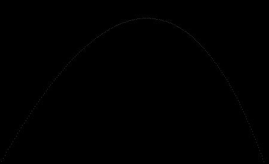

# Ray Tracer

A simple Ray Tracer implemented in Rust

## Current status

A PPM image called `ball.ppm` is generated when `cargo run` is called. The
image depicts a trajectory of a ball that is sent away from position (0, 1)
with a speed defined by the normalized vector (1, 1.8, 0) in an environment
with gravity of -0.1 and a head wind of -0.01.

The format of the image is [PPM](https://en.wikipedia.org/wiki/Netpbm). It can
be viewed (on Linux) using, for example, the following command:

`feh ball.ppm`

The image contains just a few pixels on a canvas. No ray tracing yet...

## Unit tests

All modules in the ray tracer have unit tests. To run them use

`cargo test`

To automatically run the test cases whenever a file is updated, use

`cargo watch -c -x -test`
