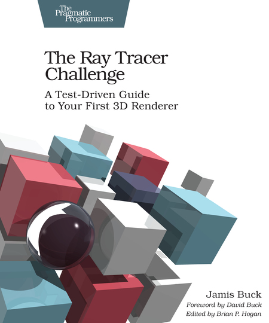

# Ray Tracer

This repo contains a simple Ray Tracer implemented in Rust. The implementation
is based on the book [*The Ray Tracer Challenge*](http://raytracerchallenge.com/)
by Jamis Buck.

## Current status

There is currently no real ray tracing in place yet, but there are a few
commands available that use the matrix operations and vector functions:
*shadow*, *trajectory*, and *clock*. Run the commands using

`cargo run <command>`

The output for each command is a [PPM](https://en.wikipedia.org/wiki/Netpbm) image.
The images can be viewed (on Linux) using, for example, the command `feh`. Use:

`feh shadow.ppm`

to show the 'shadow.ppm' image.

### Shadow

The first steps on the ray tracing are implemented under the `shadow` command.
The command places a unit sphere at origo and a light source at `(0, 0, -5)`.
The rays from the light source are traced towards a fictive wall positioned at
z position 12. If a ray 'hits' the sphere on its way towards the wall, the
corresponding pixel is painted purple. If not, the pixel is left as default
(black). The output is an image called 'shadow.ppm'.

### Clock

The clock command generates a simple clock case, with a dot for each hour. The
dots are generated using the `point` (0, 1, 0) on which three transformations
are applied:

* scaling (0, 100, 0)
* rotation around z (-2 * PI * hour / 12) radians
* translation (200, 200, 0)

The output is an image called 'clock.ppm'.

### Trajectory

A PPM image called `trajectory.ppm` is generated when `cargo run trajectory` is
called. The image depicts a trajectory of a projectile that is sent away from
position (0, 1) with a speed defined by the normalized vector (1, 1.8, 0) in an
environment with gravity of -0.1 and a head wind of -0.01.

## Unit tests

All modules in the ray tracer have unit tests. To run them use

`cargo test`

To automatically run the test cases whenever a file is updated, use

`cargo watch -c -x -test`
