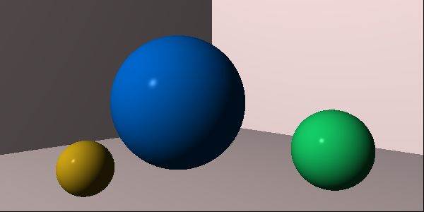
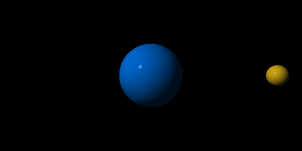
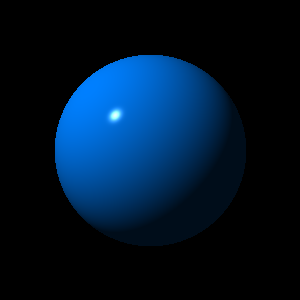
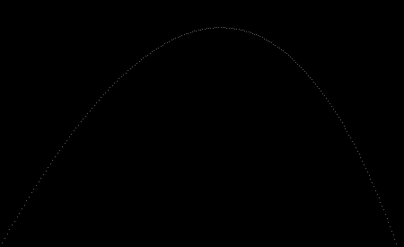

# Ray Tracer

This repo contains a simple Ray Tracer implemented in Rust. The implementation
is based on the book [*The Ray Tracer Challenge*](http://raytracerchallenge.com/)
by Jamis Buck.

The ray tracer provides a few commands to generate images using matrix
operations, vector functions and so on to calculate how pixels on a canvas
shall be colored. The current available commands are: *sphere*, *shadow*,
*trajectory*, and *clock*. Run the commands using

`cargo run <command>`

The output for each command is a [PPM](https://en.wikipedia.org/wiki/Netpbm) image.
The images can be viewed (on Linux) using, for example, the command `feh`. Use:

`feh shadow.ppm`

to show the 'shadow.ppm' image.

To convert ppm files to other file formats, the `convert` command from the
`imagemagick` tool suite can be used. Use:

`convert shadow.ppm shadow.png`

to convert the shadow ppm file to png format. Other extensions, such as .gif
and jpg also works.

## Ray tracing model

The ray tracer uses the [Phong reflection
model](https://en.wikipedia.org/wiki/Phong_reflection_model) to simulate the
reflection of light off objects. For more information, see the Wikipedia page.

## Commands

### World

The `world` command generates an image of a pre-configured world consisting of
three spheres located in a "room". A light source is located at `(-10, 10,
-10)` and a camera is located at `(0, 1.5, -5)` directed at the point `(0, 1,
0)`. The resolution of the camera is 600x300 pixels.

The rendering is done by sending a ray from the camera's origin through each
pixel in the camera direction and then using the Phong reflection model to
calculate the color. The resulting image is stored in a file called
'world.ppm'.

### Planets

The `planets` command generates a set of images that can be used to create an
animation. To create an animated gif, use the following command:

`convert -delay 0.5 -loop 0 planet-* planets.gif`

### Sphere

The `sphere` command simulates the reflection of light off an object; in this
case a sphere. In the simulation, a light source is located at `(-10, 10, -10)`
and its light is reflected off a blue sphere at origo with the radius of 1. The
reflections are captured on a canvas at z position 12. The Phong reflection
model is used to calculate the colors of the pixels at the canvas.

### Shadow

The first steps on the ray tracing are implemented under the `shadow` command.
The command places a unit sphere at origo and a light source at `(0, 0, -5)`.
The rays from the light source are traced towards a fictive wall positioned at
z position 12. If a ray 'hits' the sphere on its way towards the wall, the
corresponding pixel is painted purple. If not, the pixel is left as default
(black). The output is an image called 'shadow.ppm'.

### Clock

The clock command generates a simple clock case, with a dot for each hour. The
dots are generated using the `point` (0, 1, 0) on which three transformations
are applied:

* scaling (0, 100, 0)
* rotation around z (-2 * PI * hour / 12) radians
* translation (200, 200, 0)

The output is an image called 'clock.ppm'.

### Trajectory

A PPM image called `trajectory.ppm` is generated when `cargo run trajectory` is
called. The image depicts a trajectory of a projectile that is sent away from
position (0, 1) with a speed defined by the normalized vector (1, 1.8, 0) in an
environment with gravity of -0.1 and a head wind of -0.01.

## Unit tests

All modules in the ray tracer have unit tests. To run them use

`cargo test`

To automatically run the test cases whenever a file is updated, use

`cargo watch -c -x -test`
